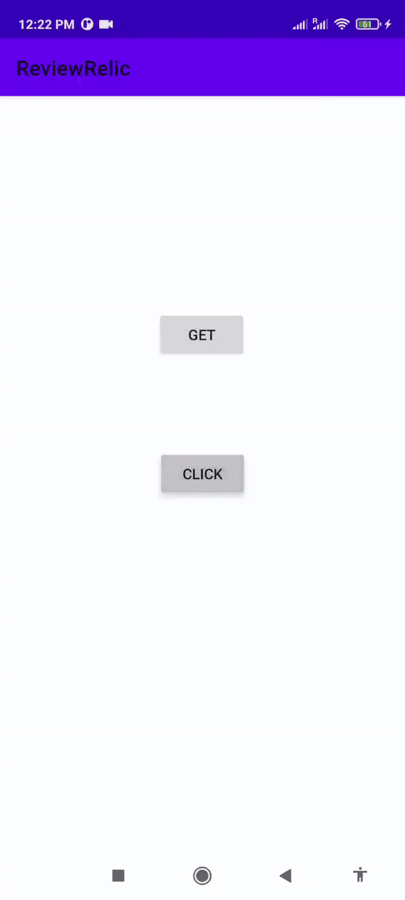

# Review Relic Android Sdk
You can create your app on [Review Relic Web portal](https://reviewrelic.com/)

  

## Installation

Review Relic for Android supports API 16 and above.

##### Step 1.
Add the JitPack repository to your build file

Add it in your root build.gradle at the end of repositories:

```Gradle
allprojects {
    repositories {
        ...
        maven { url 'https://jitpack.io' }
    }
}
```

##### Step 2.
Add the dependency

```Gradle
dependencies {
        implementation 'com.github.reviewrelic-universe:android-sdk:1.0.1'
}
```

## Sample Apps

A project with some basic example is provided [here](https://github.com/reviewrelic-universe/android-sdk/tree/1.0.0/sample).

## Permissions

We include the INTERNET permission by default as we need it to make network requests:
```xml
<uses-permission android:name="android.permission.INTERNET"/>
```
## Code Initialization

To initialize the Review Relic SDK in your app, use below snippet in your app's Application class or where ever you seems appropiate:

#### Initialize SDK

```kotlin
ReviewRelic
    .setSecretKey("") /* Secret key obtained from Web portal of review relic */
    .setToken("") /* Token obtained from Web portal of review relic */
    .setMerchantId("") /* Merchant Id obtained from Web portal of review relic */
    .enableLogging() /* Set to true if you want to see logs */
    .setInitializeListener() /* Callback for successful initialization of SDK */
    .build()
```

###### Attributes

Following are functions you need to call for SDK initialization:

| Attribute | Function |  Description | Type | Required | Default value |
|:---|:---|:---|:---|:---|:---|
| secretKey | setSecretKey() |Set the environment API key | String | Yes | Should be non-null |
| token | setToken() | Set the environment Token | String | Yes| Should be non-null |
| merchantId | setMerchantId() | Set the merchant ID | String| Yes | Should be non-null |
| logging | enableLogging() | Toggle logging for SDK | Boolean| No | false |
| onInitializedListener | setInitializeListener() | Listener for successful intializaiton of SDK | ReviewRelicOnInitializedListener | No | Null |

#### Show Sheet

```kotlin
ReviewRelic.showSheet(
    transactionId = "",  /*Transaction Id*/
    thankYouMessage = "", /*Thank you message*/
    fragmentManager = , /* Pass fragment manager from your Activity/Fragment */
    reviewRelicBottomSheetInputs = ReviewRelicBottomSheetInputs(
                    title = "", /*Title you want to show (will override the title set on Web portal)*/
                    subtitle = "", /*Subtitle  you want to show (will override the subtitle set on Web portal)*/
                    image = null /*Icon you want to show (will override the icon set on Web portal)*/
                ),
    onSubmitCallback = {} /* Callback for successfully submitting review */
)
```
###### Attributes

Following are the parameters details for showing sheet:

| Parameters  |  Description | Type | Required | Default value |
|:---|:---|:---|:---|:---|
| transactionId | Transaction Id for your review | String | No | null
| thankYouMessage | Thank you message you want to show  | String | No | "Thank you" |
| reviewRelicBottomSheetInputs | BottomSheet inputs user can override (See table for detailed attributes)  | com.review.relic.ui.ReviewRelicBottomSheetInputs | No | null |
| fragmentManager | Pass fragment manager from your Activity/Fragment | FragmentManager | Yes | Should be non-null |
| onSubmitCallback | Callback for successfully submitting review | | No

###### ReviewRelicBottomSheetInputs Attributes

Following are the parameters details for ReviewRelicBottomSheetInputs class:

| Parameters  |  Description | Type | Required | Default value |
|:---|:---|:---|:---|:---|
| title | Title you want to show (will override the title set on Web portal) | String | No | null
| subtitle | Subtitle  you want to show (will override the subtitle set on Web portal)  | String | No | null |
| image | Icon you want to show (will override the icon set on Web portal) | com.review.relic.utils.ReviewRelicImage | No | null |

###### ReviewRelicImage Attributes

Following are the parameters details for ReviewRelicImage class:

| Parameters  |  Description | Type | Required | Default value |
|:---|:---|:---|:---|:---|
| image | Image ResourceId (Drawable Int) or Base64 (String)  | Any | No | null
| type | ImageType (ResourceId,Bas64)  from com.review.relic.utils.ImageType Enum  | com.review.relic.utils.ImageType | No | null |


